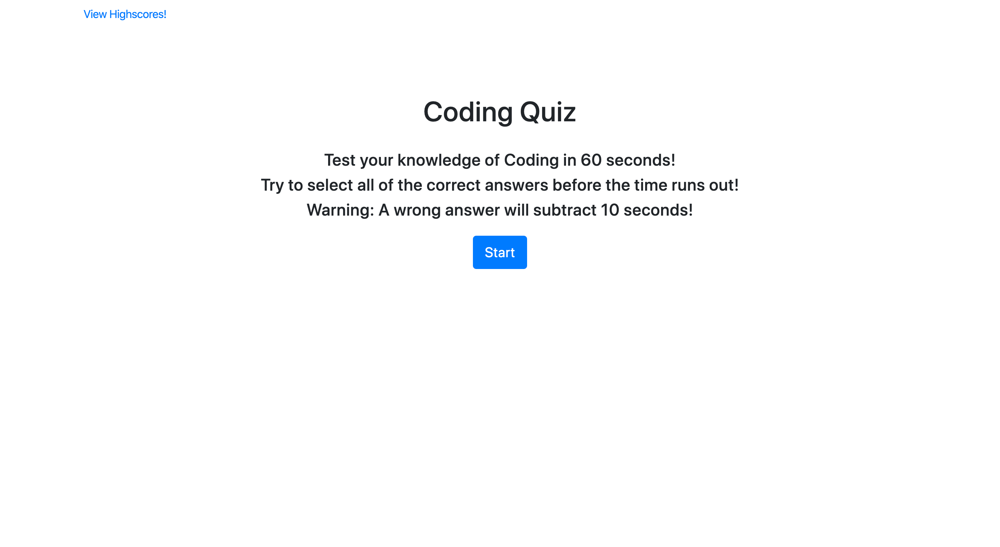
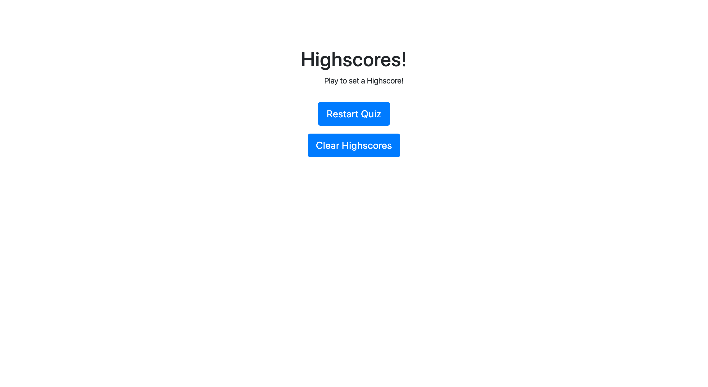
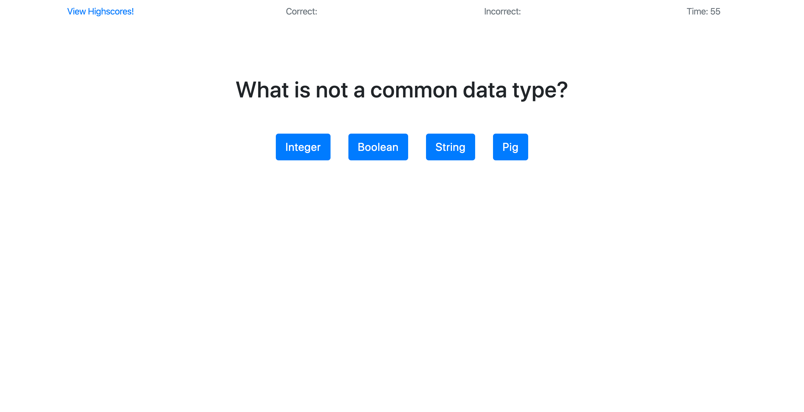
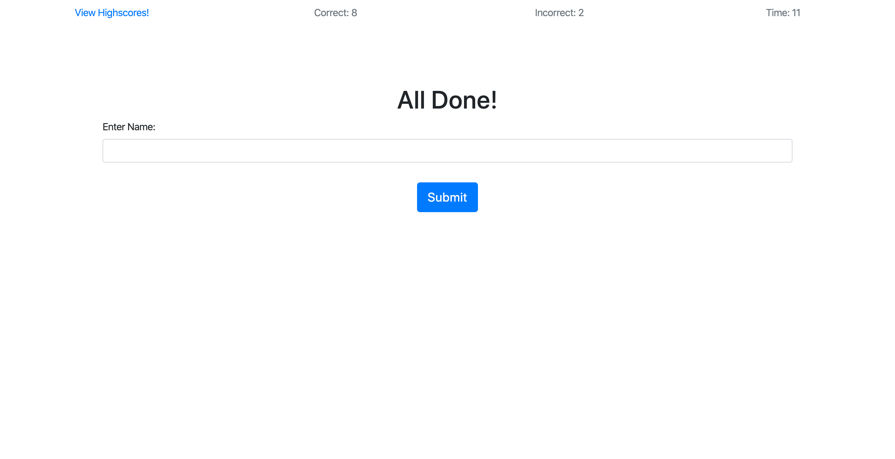
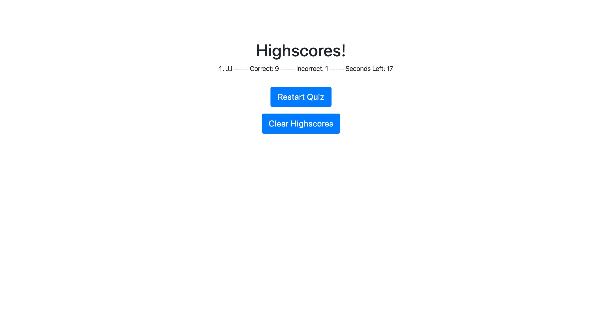

# Coding-Quiz

	When you first load the page you will find instructions and a Start button in the center of the page.

  	The View Highscores button will yield this result if the quiz has not been completed	

  	When you press Start the first question will appear and a timer will begin to count down from sixty. 
	The number of correct and incorrect answers selected will be diplayed on the top in the center.
	If you select an incorrect answer the timer will subtract ten seconds to make it harder to reach the end of the questions.
	If you select any answer the next question will appear.

  	Once all of the questions have been asked and answers are selected or the timer reaches 0 the user will be asked to enter 	  a name.

	The name the user entered, the number of incorrect and correct answers, and the time left will be saved as a highscore in 	  local storage. Then displayed in the Highscores container.
	The Reset Quiz button will begin the quiz over again and if you select View Highscores this time you will be able to see 	 the score of the last quiz completed. 
	If you select Clear Highscores all of the local storage or Highscores will be deleted.

